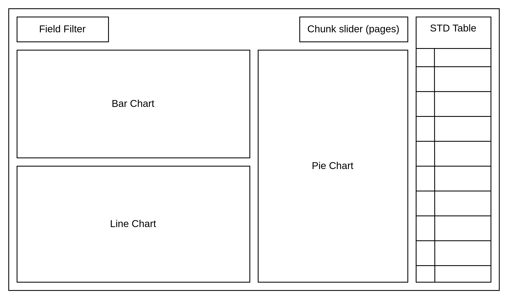

# Code Review Project Overview

This project provides a foundation for handling API requests, focusing on asynchronous programming and processing large datasets. It includes two core APIs:

1. **Slow Search API**: A country name search API with an intentionally introduced delay, designed for optimizing search response time.
2. **Big Data API**: Supplies 4MB of dataset to test efficiency in processing and visualizing large data.

### Project Directory Summary

- **server/routes/**: Contains API route implementations.
  - `slow-search.mjs`: Handles the country name search.
  - `big-data.mjs`: Provides large dataset for analysis.
  - `health.mjs`: Health check endpoint.
  - `index.mjs`: Loads all server routes.
- **server/index.mjs**: Main server entry point.
- **server/dockerfile**: Sets up Docker container for the server.
- **server/package.json**: Lists dependencies and scripts.

## Setup Instructions

### Prerequisites

- Docker & Docker Compose
- Node.js

### Steps to Run the Project

1. **Build and launch with Docker Compose**
   ```sh
   docker-compose up --build
   ```
2. **Access the APIs**
   - API Documentation: `http://localhost:8081/api-docs`
   - Health Check: `http://localhost:8081/health`

## Assignments

Create an application with 2 pages, each page for each api assigment.

### Slow Search API (Country Search Optimization)

1. **Instant Search Bar**: Create a search bar that dynamically updates results as users type, without requiring a button press.
2. **Throttling Mechanism**: Implement request throttling to minimize API calls and reduce server load.
3. **Request Management**: Cancel previous requests when a new query is entered to ensure only the latest search is processed.
4. **Results Display**: Present search results in a clear and structured list.

### Big Data API (Character Frequency Analysis)

1. **Field Filter**: Allow users to select multiple fields from the big data API to analyze character frequency.
   - **Dropdown**: Provide a dropdown list of available fields to choose from.
2. **Chunk Slider**: Show chunks of data with chunk slider (200 chunks per slide entry).
3. **Graph Generation**: Visualize data from the big data API to analyze character frequency.
   - **Bar Chart**: Show frequency of the most common character in each chunk.
   - **Line Chart**: Plot the trend of the most frequent character's occurrence across chunks.
   - **Pie Chart**: Display distribution of the most frequent characters across all chunks.
   - Use Chart.js, D3.js, or any other library to create these graphs.
4. **STD Table**: Calculate the standard deviation for character frequencies to measure variability across the dataset.

Image for reference:


### Bonus Points

- **UI Styling**: Design a clean, intuitive user interface for the search feature and results.
- **Unit Tests**: Write unit tests to validate functionality of both the search and data processing.
- **Documentation**: Include a detailed README or technical notes describing your approach, challenges, and how you addressed them.

## Notes

- The project should at the end be added to a client folder in the root of the project + add it to the docker-compose file to run the client and server at the same time.
- The search API has a 1-second delay to simulate slow network conditions.
- Don't assume that the server is always available or always fast, handle server errors gracefully.
- The server code must not be modified; the focus is on optimizing the client-side implementation and data visualization.
- The server runs on port `8081` (mapped internally from `8080` in Docker).
- This is a small project for a reason, quality is more important than quantity. Focus on clean, maintainable code.

Feel free to explore the project and showcase your creativity in the implementation. The goal is to demonstrate your proficiency in building responsive, optimized solutions for both search and large dataset analysis.
